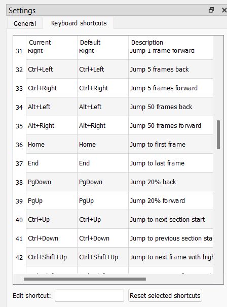
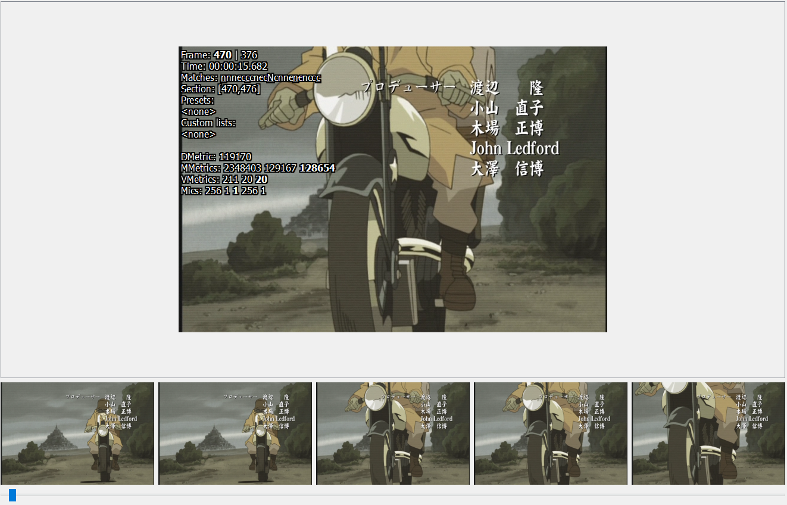
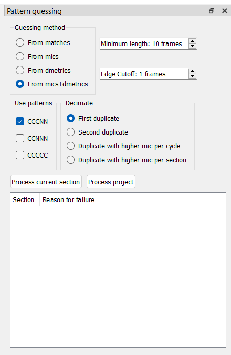
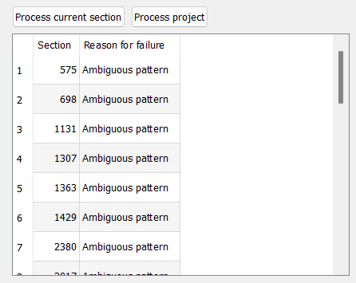
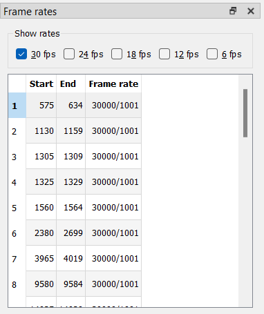
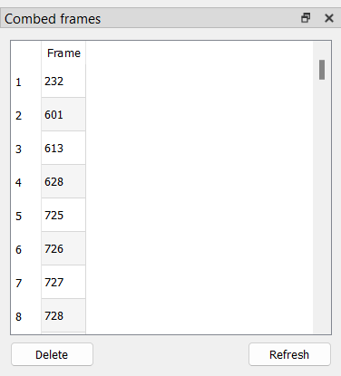
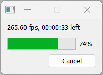

# Using Wobbly

Wobbly's job is to act as a GUI to easily adjust fieldmatches.
It makes use of the metrics collected by Wibbly to prepare a clip,
and can process those to IVTC a clip.

To get started,
grab the "wob" JSON file you generated using Wibbly
(or any other metrics gathering tool designed for wobbly)
and drag it into the Wobbly window.

## Familiarizing Yourself with the UI

Wobbly can be a bit difficult to work around for beginners.
This is because it's primarily built to work with *keybinds*.
This is a lot faster than pressing a button on-screen for every single operation,
and considering how many actions you must perform,
this will save you a lot of time and effort.

A list of keybinds can be found under the *Settings* tab.

Here is a quick table containing the relevant keybinds:

| Key                       | Action                                   |
| ------------------------- | ---------------------------------------- |
| Left Arrow                | Jump 1 frame back |
| Right Arrow               | Jump 1 frame forward |
| Ctrl + Up Arrow           | Jump to next section |
| Ctrl + Down Arrow         | Jump to previous section |
| Ctrl + Shift + Up Arrow   | Jump to next frame with high mic |
| Ctrl + Shift + Down Arrow | Jump to previous frame with high mic |
| Up Arrow                  | Jump to next frame with high dmetrics |
| Down Arrow                | Jump to previous frame with high dmetrics |
| Shift + Up Arrow          | Jump to the next combed frame |
| Shift + Down Arrow        | Jump to the previous combed frame |
| I                         | Start new section at current frame |
| Ctrl + Q                  | Delete current section |
| S                         | Cycle the current frame's match |
| Ctrl + S                  | Cycle through different patterns for the current section |
| D                         | Toggle decimation for the current frame |
| G                         | Jump to a specific frame (opens submenu) |
| Ctrl + F                  | Replace current frame with previous frame (freezeframe) |
| Shift + F                 | Replace current frame with next frame (freezeframe) |
| Ctrl + Z                  | Undo |
| Ctrl + Y                  | Redo |
| F5                        | Toggle preview mode (Source ↔ Preview) |
| Ctrl + Num + +            | Zoom in |
| Ctrl + Num + -            | Zoom out |
| (Not bound by default)    | Save Project |

These will be the shortcuts you'll use most,
so the sooner you can familiarize yourself with them,
the better.
You can always adjust them in this menu to your liking.

Make sure you don't accidentally spam Ctrl + S to save the project!
This is by default bound to "Cycle through different patterns for the current section".
It may be worthwhile to replace this keybind
if you're scared you'll accidentally cycle through sections instead of saving.

## Processing the Clip

The first order of business is to make sure you process the project.
Wobbly makes use of Wibbly's metrics to make its decisions,
but it depends on the scenechanges being correct.
Before you do anything else,
you'll want to jump from section to section
and make sure every section starts and ends on an actual scenechange.

The following keybinds will be your new best friends while correcting scenechanges:

| Key                       | Action                                   |
| ------------------------- | ---------------------------------------- |
| Left Arrow                | Jump 1 frame back |
| Right Arrow               | Jump 1 frame forward |
| Ctrl + Up Arrow           | Jump to next section |
| Ctrl + Down Arrow         | Jump to previous section |
| I                         | Start new section at current frame |
| Ctrl + Q                  | Delete current section |
| Ctrl + Z                  | Undo |

The most straight-forward way to do this
is to simply press `Ctrl + Up Arrow`
and jump forwards until you find the start of a new section
that is clearly not on a scenechange.

You then delete this section by pressing `Ctrl + Q`,
and rinse and repeat.

You may sometimes find scenechanges being skipped.
To fix those,
you use the `Left Arrow` and `Right Arrow` to framestep,
locate the first frame of the scene change,
and press `I` on your keyboard.

It's important for the processing to occur
on sections that are larger than 10 frames.
If you have for example a lot of flickers,
it's probably worthwhile to just create one larger section containing all of them,
rather than a lot of smaller sections,
as that may introduce issues during the processing.
A simple way to look at it is that every section equates a scene,
with a cut made on the start and end of it.

When dealing with fades to and from scenes,
you'll want to put the scene change somewhere in the middle.
The first frame before a fade in is usually the best,
unless it fades in from a solid colour with a clear scenechange.
To deal with crossfades
(that is, two scenes that fade into each other
without a solid color inbetween)
where the pattern differs between scenes,
you can try creating a new section
that captures just the fade.
Wobbly may be able to accurately decimate that for you.
If the pattern remains the same,
there is no reason to do this.

You follow these procedures throughout the entire clip,
creating and deleting sections as necessary.
Once you're done,
you can finally process the clip.
Navigate to the Pattern Guessing window.

You'll want to make sure you are using "From mics+dmetrics"
with an *Edge Cutoff* of 1 frame.
It's not recommended you adjust the *Minimum Length*.
For patterns,
you'll only want to select "CCCNN".
For decimation,
pick "First duplicate".
Then finally,
click "Process project"
(and make absolutely sure to NOT press that button again,
as this will ruin your project file).
It will return a list of problem sections like this:

## Fixing the Failures

There are two kinds of pattern guessing failures:

- Section too short

The section is too short for the guessing method.
This is defined by the "Minimum length" setting.
To fix this,
double-click on the failed pattern guess in the list,
adjust the section so it's larger than or equal to the minimum length,
and then click "Process current section".
If you did this properly,
it should remve the section from the list.

- Ambiguous pattern

Indicates that Wobbly was unable to find the correct pattern.
There can be multiple reasons behind this,
but it most often means that you either did not set your section correctly,
or that section can not be IVTC'd properly.

For every ambiguous pattern,
you'll want to manually fix the pattern.
You can do this by double-clicking the failed guess in the list,
and then cycle through the pattern using `Ctrl + S` by default.
Note that this won't remove the section from the list.

If you have a section that you are sure is 29.97 frame/s,
you can adjust the pattern in the "Pattern editor" window.
Set it to *30 fps* and press `Ctrl + S`.
You'll also want to apply this to any scene that requires specific post-filtering in your script.
This can be for example 59.94 frame/s credits on top of 23.976 frame/s video
(which is very common for Opening and Ending themes),
or scenes you can't match properly
and must be pulled down to 23.976 frame/s.
**Make sure you set it back to *24 fps*
after you've dealt with every known 29.97 frame/s scene!**

## Fixing the Framerates

Now that you've made most of your matches,
navigate to the "Frame rates" window.
It's easiest to go one frame rate at a time.
First,
select the "30p" checkbox.

A list of useful keybinds for this section:

| Key                       | Action                                   |
| ------------------------- | ---------------------------------------- |
| Left Arrow                | Jump 1 frame back |
| Right Arrow               | Jump 1 frame forward |
| D                         | Toggle decimation for the current frame |

### Handling 30p Scenes

29.97 frame/s framerates can show up for a couple reasons:

- You set a section to 29.97 frame/s yourself

This should be done on any scenes that are native 29.97 frame/s or 59.94 frame/s,
or requires pulldown of some kind
(overlaid 29.97 frame/s credits on 23.976 frame/s content, for example).

- Pattern changes on scenechanges leave you with an extra frame

This is not an uncommon occurrence,
as with anime the editing is often done on the telecined video.
The easiest fix for this is to simply decimate one of the extra frames.
This ensures you keep a constant frame rate.
This option is especially easy to take if the final frame in a section has an orphan field,
as the easiest way to fix those is to drop it anyway.
Another option is to keep that section 29.97 frame/s,
though you may cause desyncs during timing/subtitle syncing with other subtitles this way.

Whichever option you choose,
it pays dividends to be consistent.
One such consistency you can take
is to always drop the frame with an orphan field if possible
(these will almost always be marked as *B* matches,
so they're easy to spot),
and otherwise,
drop the frame before a scene change if there is one.
This is especially useful when IVTCing recurring clips,
such as Opening or Ending themes,
midcards,
etc.

### Handling 18p Scenes

Once you have fixed all the wrong *30p* sections,
we move on to *18p*.
*18p* is basically always going to be incorrect.
As such,
there should be 0 instances of *18p* cycles left
once you're done with IVTCing.

Usually 18p scenes happen because of awkward pattern changes across scenes
(or if you're unlucky,
within the same scene),
or because an orphan field gets dropped which breaks the framerate.
This means that in certain situations,
you may be forced to restore a duplicated frame
to ensure you still have a consistent framerate.
This is why it's recommended you apply the same consistency rule as with 30p scenes,
but some of it in reverse.
You restore orphan fields if possible,
but at scenechanges,
you restore the first frame of a scene if necessary
(unless one scene has a pan and the other does not).
This is because a "stutter" at the end of a scene is easier to spot
than a stutter at the very start of a scene.
If the 18p cycle occurs elsewhere,
use your best judgment.
Generally speaking,
you can't really go wrong if it's for example in the middle of a scene.

### Handling 12p and 6p Scenes

12p and 6p,
simply put,
only occur when you've made a mistake with manual decimations.
You can simply fix them and then handle them as you would 18p framerates
once you restore enough frames.

By the end of this,
you should have a list of 29.97 frame/s scenes
you manually and knowingly set this way.

## Cleaning Up

Useful keybinds for this section:

| Key                       | Action                                   |
| ------------------------- | ---------------------------------------- |
| Left Arrow                | Jump 1 frame back |
| Right Arrow               | Jump 1 frame forward |
| S                         | Cycle the current frame's match |
| D                         | Toggle decimation for the current frame |
| Ctrl + F                  | Replace current frame with previous frame (freezeframe) |
| Shift + F                 | Replace current frame with next frame (freezeframe) |

### Leftover Combing

Finally,
after matching scenes and forcing framerates,
you still want to deal with leftover combing.
Open the "Combed frames" menu.

Before you do anything,
click "Refresh".
This will perform another search through the clip
to find any remaining combed frames.
This may take a couple of minutes to finish.

You can now double-click on all the found combed frames,
or jump to the next combed frame using .
For any combed frame,
you can press `S` to cycle through fieldhints.
If every cycle returns a combed frames,
consider adjusting the decimated frame
(using `D` to swap between decimated and not,
making sure you don't ruin the framerates you just fixed),
or pulling it down in your filterchain later.

Another thing to take into account is that this will also find telecined fades.
You typically do not want to perform fieldmatching on the fade itself,
but just the underlying animation.
If the caught combed frame is caused by the fade,
ignore it
and process it with a filter meant to deal with those
in your filterchain later.

### Freezeframing

If you find scenes of a duplicated clip
(that was not decimated due to being animated on twos/threes/fours)
that has very heavy compression artifacting,
it might be worth it to freezeframe it with either the next frame
(`Shift + F`)
or the previous frame
(`Ctrl + F`).
You can adjust these later in the "Frozen frames" window.
This usually won't be applicable or worth it
unless you're dealing with *very* starved video
and heavy MPEG2 blocking.

Your clip should now be ready to be used in your own filterchain!
